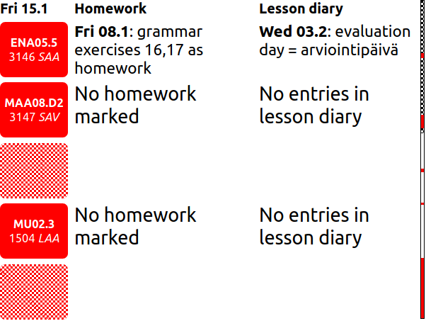

#WilmaInk

WilmaInk is a sister of my other project [Wilmacrawler](https://github.com/KaappoRaivio/wilmacrawler/), which it uses as a back-end. WilmaInk presents the data in a form that can be rendered on an e-ink display. 

This means limited resution, and very limited color palette, in my e-ink display's case 3 colors: black, white, and red:

Currently, it displays your schedule for the next day, along with associated homework and lesson diary.

This project is mainly intended to be used with e-ink displays, which explains the non-responsive rendering, and limited color palette. 

##Motivation 
As 2020 struck, I, along with other high school students, found myself sitting at the computer all day. As I was opening the same web resources used for learning day after day, the need to wait for the various webpages to load really started to grind on me. This is why I decided to make this contraption. 

In my personal use, it has decreased my need to open the Wilma webpage by 90 % or so. 

##Usage
This project can be built just like any other `create-react-app`:
1. Clone the repor and `cd` into it.
2. Run `yarn install`/`npm install`.
3. Run `yarn build`/`npm run build`.
4. The `build/` directory now contains the static html, css and JS that can be hosted by any web server program, such as Apache or Nginx. 

You can pass several parameters in the URL, which change various things:
####`lang`
Changes the language of the texts. Please note that data coming from the API isn't affected. 

currently supported values: `{"en, "fi"}`

####`skipDays`
Can be used to change the day which will be shown.

currently supported values: `[0..5]`, please keep in mind that only values belonging to the same week will show data.

####`url` 
Set the back-end url, which depends on where you are hosting your [Wilmacrawler](https://github.com/KaappoRaivio/wilmacrawler/) instance.

currently supported values: a valid URL

####`renderWidth` and `renderHeight`
Set the width and height of the rendered image.

currently supported values: a number followed by any valid css unit. 
